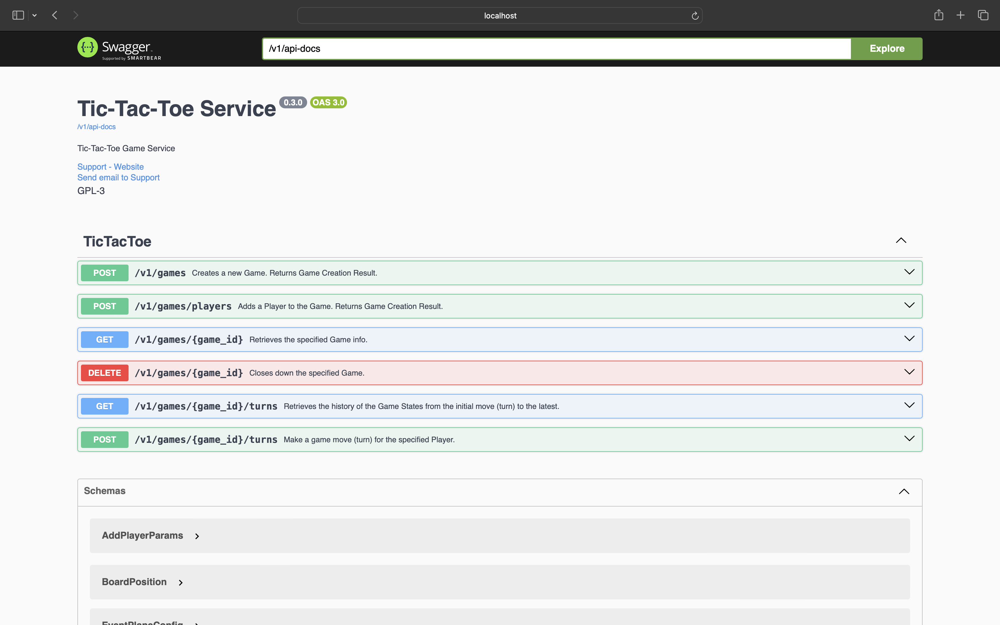
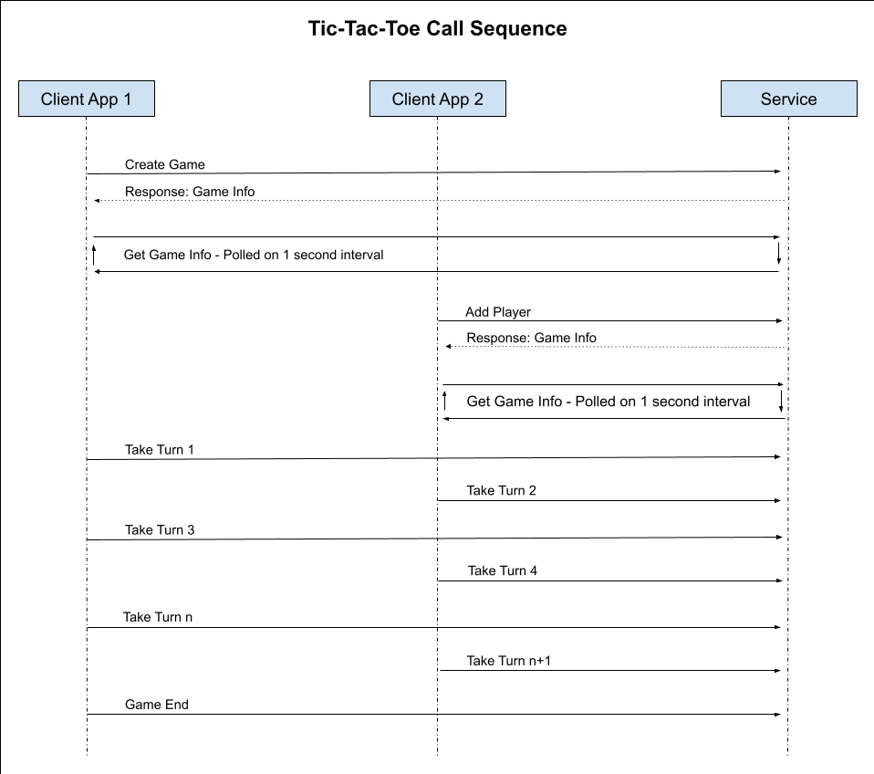

# Tic-Tac-Toe Game Service

## Description

Provides 2-client Tic-Tac-Toe game play.

_NOTE: This sample code is part of the RustMadeEasy.com course: Intro to Rust. This code is not suitable for
production. For example, the end-points are not secured and the game state is not persisted in a centralized fashion.
Lack of central persistence means that only a single instance can be run (preventing resilience and
scalability). Future courses will enhance the service so that it goes from sample-quality code to being highly secure 
and scalable._

Roadmap:

1. Validation for request parameters.
2. Authentication.
3. Docker deployment.
3. Automatic cleanup of older or abandoned Games.
4. Central persistence, e.g. Surreal DB, Redis, etc.
5. Notion of Game User-pair Session so that an invitation is still required to initially connect Users, but, a new invitation is no longer required for rematches within a Gaming Session.
6. AI model so that users can play against the service.

## API Documentation

### Swagger UI

This service supports automatically generated Swagger UI documentation. To view, run the service and point your browser to:

http://localhost:50020/v1/swagger-ui/

Here is a screenshot:

### Usage

1. The first client (Player One) starts a new Game by posting to Create Game (POST /v1/games).
2. The first client begins to gently poll the board state by calling Get Game Info (GET /v1/games/{game_id}), updating
   the UI rendering and the state of the client app.
3. Player One invites Player Two to the game by sharing the Game Invitation Code with Player Two. The invitation code is
   in the response returned by Get Game Info.
4. The second client (Player Two) joins the Game by using the Game Invitation Code and the Second Player's info to post
   to Add Player (POST /v1/games/players). The Add Player responds with Game Info which contains the Game ID required
   for all
   subsequent calls.
5. The second client begins to gently poll the board state by calling Get Game Info (GET /v1/games/{game_id}), updating
   the UI rendering and the state of the client app.
6. Each client takes turns on behalf of its Player by calling Take Turn (PUT /v1/games/{game_id}/turns).
7. When the board state response from the Take Turn call indicates that the Game is won or stalemated, the clients show
   this visually and disallow further game play.
8. The first client calls End Game (DELETE /v1/games/{game_id}).

## Running the Service

From the source root folder:

`cargo run --release`

With the service already built and installed in your system's path:

`tic-tac-toe-service`

## Open API 3

This service generates an OpenAPI3 specification document that can be used to create the Swagger UI and to create PostMan collections, client SDKs, etc.

### Generating a Client SDK

1. Run the service.

2. Run [openapi-generator](https://github.com/OpenAPITools/openapi-generator?tab=readme-ov-file#1---installation) to create the desired client SDK. Some examples follow:

#### Kotlin
`openapi-generator generate -i "http://localhost:50020/v1/api-docs" -g kotlin -o ./client-sdks/kotlin/tic-tac-toe-kotlin-client-sdk`

#### Rust
`openapi-generator generate -i "http://localhost:50020/v1/api-docs" -g rust -o ./client-sdks/tic-tac-toe-rust-client-sdk --package-name tic_tac_toe_rust_client_sdk --additional-properties=avoidBoxedModels=true`
`openapi-generator generate -i "http://localhost:50020/v1/api-docs" -g rust -o ./client-sdks/tic-tac-toe-rust-client-sdk --package-name tic_tac_toe_rust_client_sdk --additional-properties=avoidBoxedModels=true,supportAsync=false`

#### Swift
`openapi-generator generate -i "http://localhost:50020/v1/api-docs" -g swift5 -o ./client-sdks/tic-tac-toe-swift-client-sdk`

### Generating a Postman Collection

1. Run the service.

2. Run openapi-generator to create the Postman Collection. An example follows:

`openapi-generator generate -i "http://localhost:50020/v1/api-docs" -g postman-collection -o ./postman-collections/tic-tac-toe-swift`

## Port

`50020`

## Source code and additional documentation

https://github.com/RustMadeEasy/course-work/tree/master/TicTacToe/tic-tac-toe-service