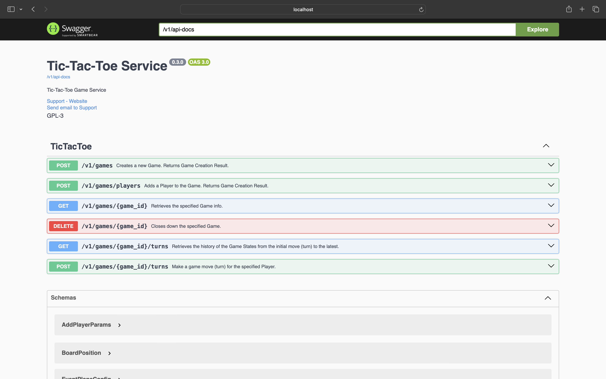
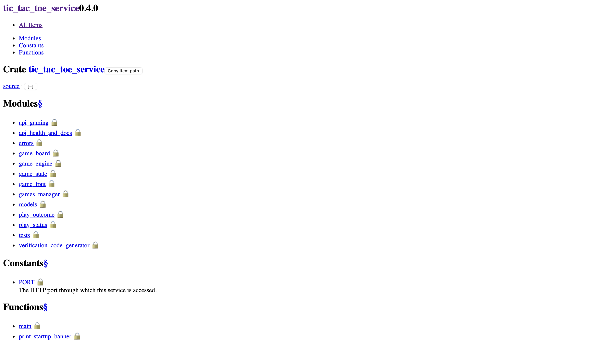
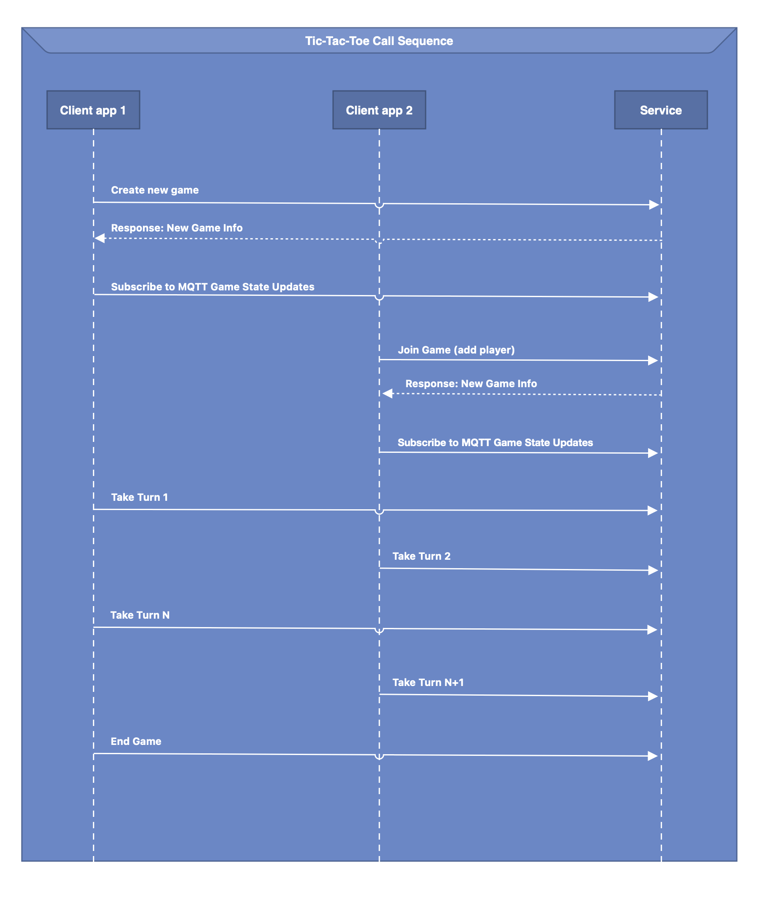

# Tic-Tac-Toe Game Service

## Description

Provides 2-client Tic-Tac-Toe game play. This includes game session management, game setup, invitation, turn-taking,
and realtime notifications of game state changes.

_NOTE: This sample code is part of the RustMadeEasy.com, Intro to Rust course and is not meant for production use.
For example, the end-points are not secured and the game state is not persisted in a centralized fashion.

Lack of central persistence means that only a single instance can be run (preventing resilience and
scalability). Future courses will enhance the service so that it goes from sample-quality code to being highly secure
and scalable._

## Why Rust?

### Performance

Services written in Rust typically have 1/10th the deployment size and 1/10th the memory footprint of comparable
services written, for example, in SpringBoot. Rust services also, generally, spin up quicker, have a lower request
latency, and can process more requests per second.

These attributes can be leveraged to achieve greater platform performance and/or to substantially lower operating costs.

See the
latest [Tech Empower benchmarks here](https://www.techempower.com/benchmarks/#hw=ph&test=fortune&section=data-r22).

### Code Correctness

Rust is a programming language designed to mitigate several classes of programming errors often encountered when using
many other languages.

Per Wikipedia:

"Rust is a general-purpose programming language emphasizing performance, type safety, and concurrency. It enforces
memory safety, meaning that all references point to valid memory. It does so without a traditional garbage collector;
instead, both memory safety errors and data races are prevented by the "borrow checker", which tracks the object
lifetime of references at compile time."

## Documentation

### Swagger UI

This service supports Swagger UI documentation. To view the documentation, run the service and point your browser to:

http://localhost:50020/v1/swagger-ui/

Here is a screenshot:

### Code-Level Documentation

From the source root folder (tic-tac-toe-service) run the following command to build and open the resulting JavaDoc
style documentation:

`cargo doc && open ./target/doc/tic_tac_toe_service/index.html`

Here is a screenshot:

### Usage Overview

1. The first client (Player One) starts a new Game by posting to Create Game (POST /v1/games).
2. The first client subscribes to game-change updates via MQTT, updating the UI rendering and the state of the client
   app.
3. Player One invites Player Two to the game by sharing the Game Invitation Code with Player Two. The invitation code is
   supplied in the response to Create Game.
4. The second client (Player Two) joins the Game by using the Game Invitation Code and the Second Player's info to post
   to Add Player (POST /v1/games/players). The Add Player responds with New Game Info which contains the Game ID
   required
   for all subsequent calls.
5. The second client subscribes to game-change updates via MQTT, updating the UI rendering and the state of the client
   app.
6. Each client takes turns on behalf of its Player by calling Take Turn (PUT /v1/games/{game_id}/turns).
7. When the game state indicates a win or stalemate, the clients show this visually and disallow further game
   play.
8. The first client calls End Game (DELETE /v1/games/{game_id}).

## Project Prerequisites

Install the latest stable version of the [Rust toolchain](https://www.rust-lang.org/tools/install):

`curl --proto '=https' --tlsv1.2 -sSf https://sh.rustup.rs | sh`

Then, you can browse the code using your favorite IDE
such [RustRover](https://www.jetbrains.com/rust/download/#section=mac)
or [Visual Code](https://code.visualstudio.com/download), etc.

## Building and Running the Service

### Directly

From the source root folder (tic-tac-toe-service) run the following command:

`cargo run --release`

If the service is already built and installed in your system's path, you can run it using the following:

`tic-tac-toe-service`

### Within Docker

`cd [path to course-work]`

`docker build -t tic-tac-toe-service:latest -f ./TicTacToe/tic-tac-toe-service/Dockerfile .`

Note that the terminating "." is required.

## Open API 3

This service generates an OpenAPI3 specification document that can be used to create Swagger UI documentation, PostMan
collections, client SDKs, etc.

### Generating a Client SDK

1. Run the service.

2. Run [openapi-generator](https://github.com/OpenAPITools/openapi-generator?tab=readme-ov-file#1---installation) to
   create the desired client SDK. Some examples follow:

#### Kotlin

`openapi-generator generate -i "http://localhost:50020/v1/api-docs" -g kotlin -o ./client-sdks/kotlin/tic-tac-toe-kotlin-client-sdk`

#### Rust

`openapi-generator generate -i "http://localhost:50020/v1/api-docs" -g rust -o ./client-sdks/tic-tac-toe-rust-client-sdk --package-name tic_tac_toe_rust_client_sdk --additional-properties=avoidBoxedModels=true`

`openapi-generator generate -i "http://localhost:50020/v1/api-docs" -g rust -o ./client-sdks/tic-tac-toe-rust-client-sdk --package-name tic_tac_toe_rust_client_sdk --additional-properties=avoidBoxedModels=true,supportAsync=false`

#### Swift

`openapi-generator generate -i "http://localhost:50020/v1/api-docs" -g swift5 -o ./client-sdks/tic-tac-toe-swift-client-sdk`

### Generating a Postman Collection

1. Run the service.

2. Run openapi-generator to create the Postman Collection. An example follows:

`openapi-generator generate -i "http://localhost:50020/v1/api-docs" -g postman-collection -o ./postman-collections/tic-tac-toe-swift`

## Port

This service is accessible on the following port: `50020`

## Future Roadmap

1. Update the clients to support rematch now that the Invitation Code is at the Player level.
2. Central persistence, e.g., Our Mem Cache, Surreal DB, Redis, etc.
3. Authentication.
